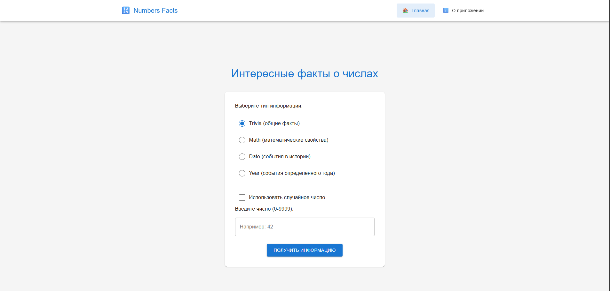
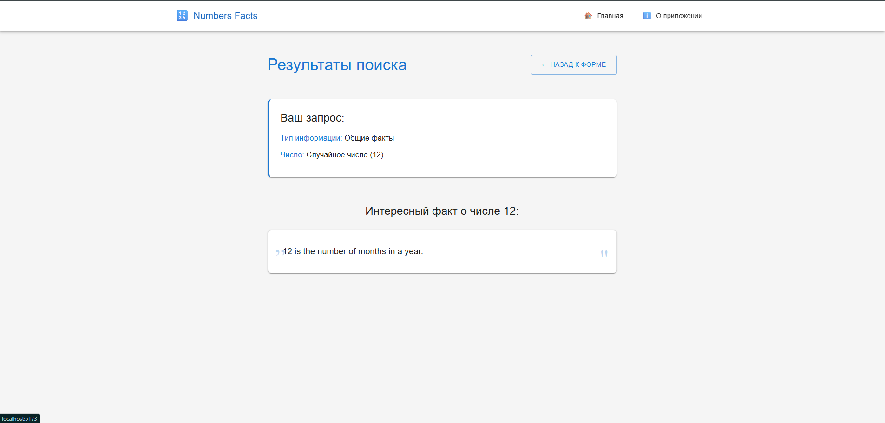

# Numbers Facts App

Простое одностраничное приложение для отображения интересных фактов о числах с использованием Numbers API.

## Скриншоты

### Главная страница



### Страница результатов



## Функциональность

- **Типы информации**: Trivia (общие факты), Math (математические свойства), Date (события в истории), Year (события определенного года)
- **Выбор чисел**: можно ввести конкретное число (0-9999) или выбрать случайное
- **Валидация**: проверка введенных данных с отображением ошибок
- **Навигация**: React Router для перехода между страницами
- **Адаптивный дизайн**: Material-UI стилизация

## Технологии

- React 18 + TypeScript
- Vite
- React Router
- Atomic Design Architecture
- Material-UI стилизация
- Numbers API (numbersapi.com)

## Установка и запуск

```bash
npm install
npm run dev
```

## Структура проекта

Проект использует Atomic Design методологию:

- `atoms/` - базовые компоненты (Button, Input, Checkbox)
- `molecules/` - составные компоненты (InputField, RadioGroup)
- `organisms/` - сложные компоненты (Navigation, Forms)
- `templates/` - шаблоны страниц
- `pages/` - готовые страницы
